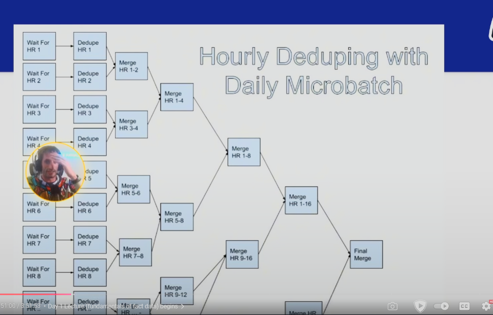

# FACT DATA MODELLING

## What is Fact?
- Something that happened or occured.
    - User login to app
    - Transaction is made
- Fact are not slowly changing which makes them easier to model than dimension in some respects

## What makes fact modelling hard?
- LOTS OF DATA
- Usually 10-100x volume of dimension data
- Fact data need a lot of context for effective analysis
    - Fact need another fact data to make sense
- Duplicates are way common than dimensional data
    - Can caused by data quality issues,
    - Sometimes can be genuine duplicates eg. 2 users clicking same link
    - Most pain of fact modelling is caused by duplication.

## How does fact modelling work?
- Normalization vs Denormalization
    - Normalization facts dont have any dimensional attributes, just IDs to join to retrieve data - to make performance faster
    - Denormalization facts have dimensional attributes for quicker analysis at the cost of more storage
- Both normalized and denormalized facts have place in this world
- Fact data and raw logs are not the same thing
    - Raw logs
        - Ugly schemas designed for online system that make data analysis sad
        - Potentially contains duplicates and other quality error - no quality guarantees
        - Usually have shorter retention
    - Fact data
        - Nice column names
        - Quality guaranteed - uniqueness, not null, etc
        - Longer retention

- How the work?
    - Think of Who, What, Where, When and How
        - Who - usually the IDs (this user clicked this button)
        - Where - most likely to bring in dimension (device_id)
        - How - very similar to where fields. He used iphone to make this click
        - What - nature of the fact (GENERATED, SENT, CLICKED, DELIVERED)
        - When - nature of the fact(event timestamp, event date, event time) - client site loggig for easier time
- Fact data should have quality guarantees
    - if didnt, analysis would just go to the raw logs
    - for example, what and when field shouldnt be null, coz the data doesnt make much sense if null.
- Fact data should generally be smaller than raw logs.
- Fact data should parse out hard-to-understand column
    - Could be some complex depending on the business
    - But generally should be easy to understand

## When you should model in dimension?
- Sometimes DENORMALIZATION is the way to go, not the cause

## How does logging fit into fact data?
- Logging brings in all critical context for your fact data
    - Usually done in collaboration with online system engineer
- Dont log everything
    - Log only what you really need
    - Cause a lot of time can be expensive and costly
- Loggin should conform to values specified by the online teams
    - Thrift is used at airbnb and netflix for this
    - There should exist middlelayer to share schema between online team and data engineer
    - keeping everyone on the same page and shared vision

## Potential options when working with high volume fact data
- Sampling
    - Works best for metric driven use case where imprecision isnt an issue, doesnt work for all cases
- Bucketing
    - Fact data can be bucketed by one of the important dimensions (usually user, the who field)
    - Bucket joins can be much faster than shuffle joins
    - Sorted-merge Bucket (SMB) joins can do joins without shuffle at all

## How long should you hold onto fact data?
- High volumes make fact data much more costly to hold onto for a long time
- Big tech hand an interesting approach here
    - Any fact tables <10TBs, retention didnt matter much
        - Anonymization of facts usually happened after 60-90 days though and the data would be moved to a new table with PII stripped
    - Any fact tables >100TBs, VERY SHORT RETENTION (14 days or less)

## Deduplication of fact data
- Fact can often be duplicated
    - You can click a notification multiple times
- How do you pick right window for deduplication?
    - No duplicates in a day? An hour? A week?
    - Looking at distribution of duplicates here is good idea
- Intraday deduping options
    - Streaming
    - Microbatch
- Streaming allows to capture most duplicates in a very efficient manner
    - Windowing matters here
    - Entire day duplicates can be harder to streaming because it needs to hold onto such a big window of memory
    - A large memory of duplicates usually happen within a short time of first event
    - 15 minute to hourly windows are a sweet spot

## Hourly Microbatch Dedupe
- USed to reduce landing time of daily table that  dedupe slowly
- Worked at Facebook using this patter
    - Deduiplicated 50 billion notification events every day
    - Reduced landing time from 9 hours after UTC to 1 hour before UTC
- Dedupe each hour with GROUP BY
- Use SUM and COUNT to aggregate duplicates, use COLLECT_LIST to collect metadata about the duplicats that might be different
- Dedupe between hours with FULL OUTER JOIN like branches of a tree

    - 
- works great because low latency, no need to wait,
- works for arbitrary scale