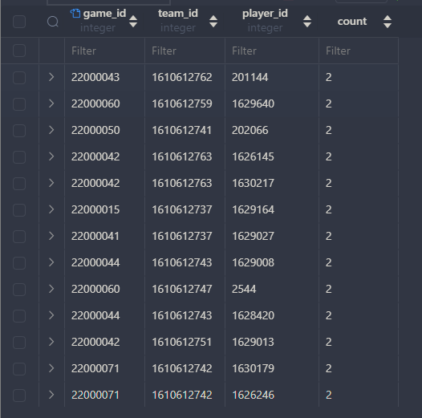
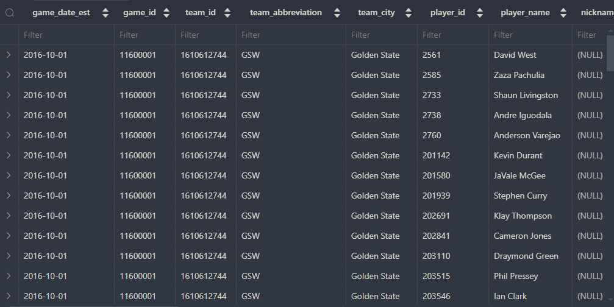

# FACT DATA MODELLING

# Finding and removing the duplicates

- The table that we will be working on is the game_details from the same postgres database

- One of the main priority building a fact table is identifying the grain data that you want to work with. .. then find remove the duplication if any.
- For starters, we can use COUNT() to understand how many duplicates from these data

    ```sql
        SELECT 
            game_id, team_id, player_id, COUNT(1)
        from game_details
        GROUP BY 1,2,3
        HAVING COUNT(1) > 1;
    ```

- Results will show you how many duplicates for each unique column combination. In this case we got 2 for each.

    - 

- Let's proceed with removing the duplicates using the ROW_NUMBER() and PARTITION BY

    ```sql
        WITH deduped AS (
            SELECT
                *, ROW_NUMBER() OVER (PARTITION BY game_id, team_id, player_id) AS row_num
            FROM game_details
        )
        SELECT
            *
        FROM deduped WHERE row_num = 1;
    ```

- Another thing about fact modelling is, you want to include the WHEN components to provide a the time context for the fact table. In this case we can use game_date_est from the games table to bring in the WHEN component.

   ```sql
        WITH deduped AS (
            SELECT
                g.game_date_est,
                gd.*,
                ROW_NUMBER() OVER (PARTITION BY gd.game_id, team_id, player_id ORDER BY g.game_date_est) AS row_num
            FROM game_details gd
            JOIN games g
                ON gd.game_id = g.game_id
        )
        SELECT
            *
        FROM deduped WHERE row_num = 1;
    ```

- Now the data looks more pretty with the time context

    - 

- Let's proceed with building the DDL statement to create the fact table. Before that you need to know which columns needed and also the data types associate with.

   ```sql
        CREATE TABLE fct_game_details (
            dim_game_date DATE,
            dim_season INTEGER,
            dim_team_id INTEGER,
            dim_player_id INTEGER,
            dim_player_name TEXT,
            dim_start_position TEXT,
            dim_is_playing_at_home BOOLEAN,
            dim_did_not_play BOOLEAN,
            dim_did_not_dress BOOLEAN,
            dim_not_with_team BOOLEAN,
            m_minutes REAL,
            m_fgm INTEGER,
            m_fga INTEGER,
            m_fg3m INTEGER,
            m_fg3a INTEGER,
            m_ftm INTEGER,
            m_fta INTEGER,
            m_oreb INTEGER,
            m_dreb INTEGER,
            m_reb INTEGER,
            m_ast INTEGER,
            m_stl INTEGER,
            m_blk INTEGER,
            m_turnovers INTEGER,
            m_pf INTEGER,
            m_pts INTEGER,
            m_plus_minus INTEGER,
            PRIMARY KEY (dim_game_date, dim_team_id, dim_player_id)
        );
    ```

- Now we can you can proceed to insert the data as below. We will explain the details after that.

    ```sql
        INSERT INTO fct_game_details
        WITH deduped AS (
            SELECT
                g.game_date_est,
                g.season,
                g.home_team_id,
                gd.*,
                ROW_NUMBER() OVER (PARTITION BY gd.game_id, team_id, player_id ORDER BY g.game_date_est) AS row_num
            FROM game_details gd
            JOIN games g
                ON gd.game_id = g.game_id
        )
        SELECT
            game_date_est AS dim_game_date,
            season AS dim_season,
            team_id AS dim_team_id,
            player_id AS dim_player_id,
            player_name AS dim_player_name,
            start_position AS dim_start_position,
            team_id = home_team_id AS dim_is_playing_at_home,
            COALESCE(POSITION('DNP' IN comment), 0) > 0 AS dim_did_not_play,
            COALESCE(POSITION('DND' IN comment), 0) > 0 AS dim_did_not_dress,
            COALESCE(POSITION('NWT' IN comment), 0) > 0 AS dim_not_with_team,
            CAST(SPLIT_PART(min, ':', 1) AS  REAL)
                + CAST(SPLIT_PART(min, ':', 2) AS REAL)/60
            AS m_minutes,
            fgm AS m_fgm,
            fga AS m_fga,
            fg3m AS m_fg3m, 
            fg3a AS m_fg3a,
            ftm AS m_ftm,
            fta AS m_fta,
            oreb AS m_oreb,
            dreb AS m_dreb,
            reb AS m_reb,
            ast AS m_ast,
            stl AS m_stl,
            blk AS m_blk,
            "TO" AS m_turnovers,
            pf AS m_pf,
            pts AS m_pts,
            plus_minus AS m_plus_minus
        FROM deduped WHERE row_num = 1;
    ```

- Now that you got the data filling the fact table. Let's take a look what do we actually need in prior when we want to process the data to the table.

    - Converting comment column to a BOOLEAN column.
        - comment column has very very high cardinality and by analysing the pattern we can actually convert them into BOOLEAN to make a more efficient column format.
    - Converting minutes column to a REAL column.
        - minutes column is a string column and we can actually convert it to a REAL column by adding the minutes and seconds together and dividing it by 60. This makes processing them very efficient while keeping the format more compact.
    - Using dim and m for naming convention in fact table.
       - dim for group by and filter on
       - m for aggregate and math operation on
       - easy for the eyes to read and understand, something that is very common in fact table