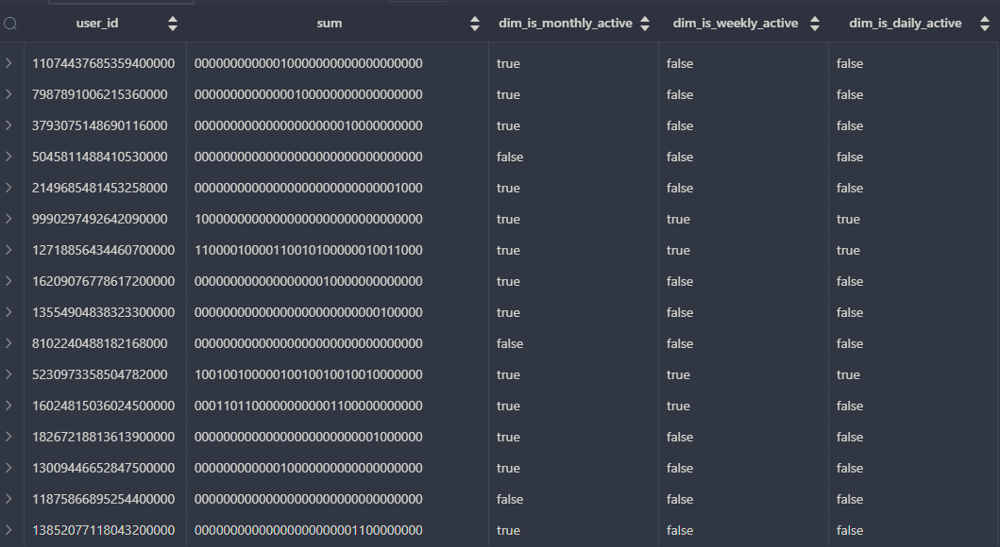

# Buiding DATELIST Fact Data Modelling For Growth Analysis


- Building the users_cumulated table.

    ```sql
        CREATE TABLE users_cumulated (
            user_id TEXT,
            dates_active DATE[],
            date DATE,
            PRIMARY KEY (user_id, date)
        );
    ```

- Build the cumulative table design query insert to populate the table

    ```sql
        INSERT INTO users_cumulated
        WITH yesterday AS (
            SELECT * FROM users_cumulated
            WHERE date = DATE('2023-01-30')
        ),
        today AS (
            SELECT
                CAST(user_id AS TEXT) AS user_id,
                DATE(CAST(event_time AS DATE)) AS date_active
            FROM events
            WHERE DATE(CAST(event_time AS DATE)) = DATE('2023-01-31')
                AND user_id IS NOT NULL
            GROUP BY user_id, DATE(CAST(event_time AS DATE))
        )
        SELECT
            COALESCE(t.user_id, y.user_id) AS user_id,
            CASE
                WHEN y.dates_active IS NULL
                    THEN ARRAY[t.date_active]
                WHEN t.date_active IS NULL THEN y.dates_active
                ELSE ARRAY[t.date_active] || y.dates_active
            END AS dates_active,
            COALESCE(t.date_active, y.date + INTERVAL '1 day') AS date
        FROM today t
        FULL OUTER JOIN yesterday y
        ON t.user_id = y.user_id;
    ```

- Select table to see terusltes

    ```sql
        SELECT * FROM users_cumulated
        WHERE date = DATE('2023-01-30');
    ```

- Now, how do you calculate the growth analysis using the users_cumulated table? This is the harder part but the most exciting.

```sql
    WITH users AS (
        SELECT * FROM users_cumulated
        WHERE date = DATE('2023-01-30')
    ),
    series AS (
        SELECT
            *
        FROM generate_series(   DATE('2023-01-01'),
                                DATE('2023-01-31'),
                                INTERVAL '1 day') AS series_date
    ),
    place_holder_ints AS (
        SELECT
            CASE
                WHEN dates_active @> ARRAY [DATE(series_date)]
                THEN CAST(POW(2, 32 - (date - DATE(series_date))) AS BIGINT)
                ELSE 0
            END AS placeholder_int_value, *
        FROM users
        CROSS JOIN series
    )
    SELECT
        user_id,
        CAST(CAST(SUM(placeholder_int_value) AS BIGINT) AS BIT(32)),
        BIT_COUNT(CAST(CAST(SUM(placeholder_int_value) AS BIGINT) AS BIT(32))) > 0 AS dim_is_monthly_active,
        BIT_COUNT(CAST('11111110000000000000000000000000' AS BIT(32)) & CAST(CAST(SUM(placeholder_int_value) AS BIGINT) AS BIT(32))) > 0 AS dim_is_weekly_active,
        BIT_COUNT(CAST('10000000000000000000000000000000' AS BIT(32)) & CAST(CAST(SUM(placeholder_int_value) AS BIGINT) AS BIT(32))) > 0 AS dim_is_daily_active
    FROM place_holder_ints
    GROUP BY user_id
```

- And you got this results ...

    

- So what happens here? The binary is a representation of the dates_active array spanning across 1 month and the 'value' means the user is active. This is the value we got when we compare if the dates_active do exist in the date array using the @> operator.

- Then if exists, we will convert them into the binary representation using the POW function formula. You want to cast them to BIGINT format because the number is very huge.

- By using the BIT_COUNT function, we can retrieve them back as normal value. This is where we get the trends.

- Another fun part is, you can compare the binary to '11111110000000000000000000000000' to see the whether the user is active for the last 7 days.

- And '10000000000000000000000000000000' to see the whether the user is active for the last 1 day.

- If you see, there are only 7 '1's as the pattern of active for the last 7 days. And only '1' for the last 1 day. This is why the query is powerful and since it is computed based on the binary function, it is very fast.


