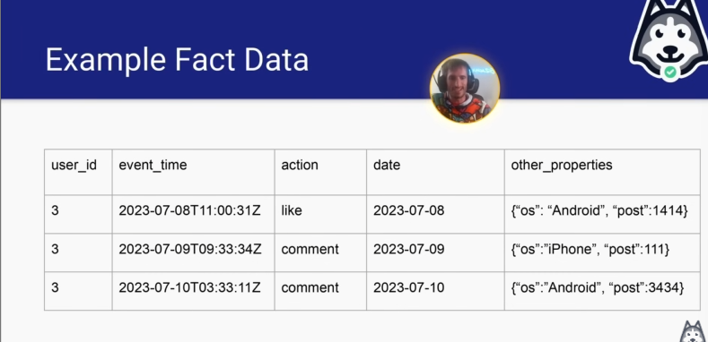
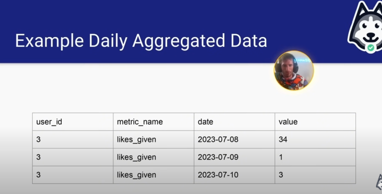
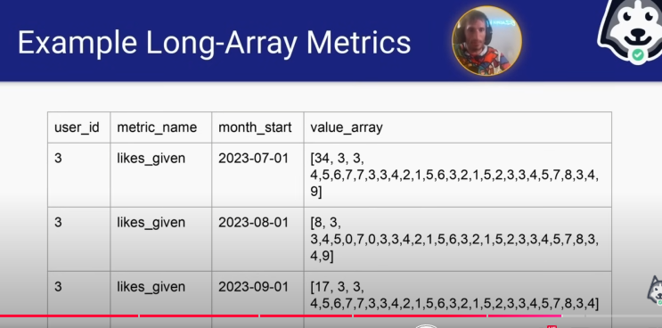

# SHUFFLING ON DATA MODELLING

#### Why Shuffle Should Be Minimized?

- Shuffle bottlenecks parralelism

#### Types of Queries That are Highly Parallelizable

- **Extremely parallel**
    - **SELECT, FROM, WHERE**
    - This only scans and read from one machine
    - Data is **only at one place**, no need to shuffle, only scan
- **Kinda parallel**
    - **GROUP BY, JOIN, HAVING**
    - Due to aggregation, **data is moving to another places** compared to initial state when collected
- **Not parallel at all**
    - **ORDER BY**
    - The hardest to parallelize
    - Should almost **never use** at the end of query, on partition is a different story
    - Order is a global operation, need to know every element position before operates.

#### How to make GROUP BY more EFFICIENT?

- Create buckets for GROUP BY
    - Cardinality bucketing
- Reduce data as much as possible

#### Reduced Fact Data Modelling to Further Reducing Row

- Original fact data often has this schema
    - user_id, **event_time, action**, date_partition
    - **1 row per event**, very **HIGH** volume
- Daily aggregation schema
    - user_id, **action_count**, date_partition
    - **1 row per user per day**, **MEDIUM** size
- Reduced fact data modelling
    - user_id, **action_count ARRAY, month_start_partition / year_start_partition**
    - **1 row per user per month/year**, very **LOW** volume

- Example Fact Data

    - 

    - This type is schema will have trouble when answering long term question analysis

- Example Daily Aggregated fact data

    - 

    - Nicer, instead of 1 row per user per event, now we have 1 row per day with their action count

- Example Reduced fact data / Long Array Metrics

    - 

    - Very useful when you want to extract long term metrics
    - Each item in value_array, it reflects value metric - which is in this case likes_given
    - Almost same like BINARY bitwise operation, but this time it is not binary

#### How Reduced Fact Data Modelling Is Stored?

- Daily dates are stored as an offset of month_start / year_start
    - First index is for date month_start + zero days
    - Last index is for date month_start + array_length - 1

#### Impact of Reduced Fact Data

- Impact of analysis
    - Multi-year analysis took hours instead of weeks
    - Unlocked decades-long slow burn analyses at Facebook
- Allowed for fast correlation analysis between user-level metrics
and dimensions

