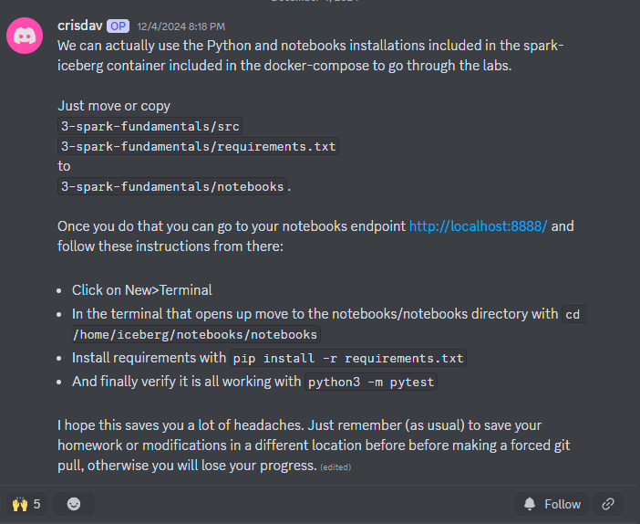

- s3 minio Error
    - : org.apache.iceberg.exceptions.ServiceFailureException: Server error: NotFoundException: Location does not exist: s3://warehouse/bootcamp/matches_bucketed/metadata/00001-6cb91c01-7cf5-422f-bfb8-38d6fe9b6f1b.metadata.json

    - UPDATE DOCKER FILE
        -     entrypoint: >
                /bin/sh -c "
                until (/usr/bin/mc config host add minio http://minio:9000/ admin password) do echo '...waiting...' && sleep 1; done;
                /usr/bin/mc mb minio/warehouse || echo 'Warehouse already exists';
                /usr/bin/mc policy set public minio/warehouse;
                tail -f /dev/null
                "

- OutOfMemoryError: Java heap space
    - java.lang.OutOfMemoryError: Java heap space
	at java.base/java.io.ByteArrayOutputStream.<init>(ByteArrayOutputStream.java:79)
	at org.apache.iceberg.shaded.org.apache.parquet.hadoop.CodecFactory$HeapBytesCompressor.<init>(CodecFactory.java:158)
	at org.apache.iceberg.shaded.org.apache.parquet.hadoop.CodecFactory.createCompressor(CodecFactory.java:219)
	at org.apache.iceberg.shaded.org.apache.parquet.hadoop.CodecFactory.getCompressor(CodecFactory.java:202) ....

    - Update docker resource
    - update file /opt/spark/conf/spark-defaults.conf...
        -   spark.serializer                       org.apache.spark.serializer.KryoSerializer
            spark.driver.memory                    16g
            spark.executor.extraJavaOptions        -XX:+PrintGCDetails
            spark.memory.offHeap.enabled           true
            spark.memory.offHeap.size              16g