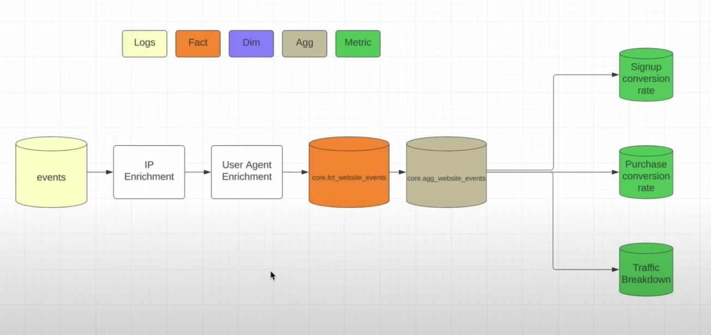

# Growth Pipeline Specification

## XX User Growth Pipeline

#### This pipeline measure website traffic and user growth.

#### The goal of this pipeline is to answer following questions
- How many people are going to xx.com and xxx.com on daily basis?
    - What is the geographical and device break down of traffic?
    - Where are these people coming from? LinkedIn? Substack?
- How many people are signing up with an account on xx.com/signup each day?
    - What percentage of traffice is converting to signing up?
- How many people are purchasing boot camps and courses at xx.com/bootcamp?
    - What percentage of signups convert to paying customers?

## Business Metrics
|  **Metric Name** | **Definition**  | **is Guardrail** |
| :------ | :------  | :------: |
| **signup_conversion_rate** | COUNT(signups)/COUNT(website_hits) | YES |
| **purchase_conversion_rate** | COUNT(purchases)/COUNT(signups) | YES |
| **traffic_breakdown** | COUNT(website_hits) GROUP BY referrer | NO |

- Guardrail means if the metrics goes down, it will heavily impact the business

## Flow Diagram

-    

## Schemas

- **core.fct_website_events**
    - This table is a list of all events for xx.com and includes IP enrichment and user agent enrinchment for country and device specific information.
    - Unique identifier for this table is logged_out_user_id and event_time

    -   | **Column Name** | **Column Type** | **Column Comment** |
        | :------ | :------  | :------ |
        | *user_id* | BIGINT | This column is nullable for logged out events. This column indicates the user who generated this event. |
        | logged_out_user_id | BIGINT | Hash of IP address and device information (using murmur3 hash)|
        | dim_hostname | STRING | The host associated with event | 
        | dim_country | STRING | The country associated with the IP address of this request |
        | dim_device_brand | STRING | The device branch associated with this request |
        | dim_action_type | STRING | This is an enumerated list of actions that a user could take on this website (signup, watch video, go to landing page, etc) |
        | event_timestamp | TIMESTAMP | The UTC timestamp for logged events |
        | other_properties | MAP[STRING, STRING] | Any other valid properties that are part of this request |
        | ds | STRING | This is the partition column for this table |

- Quality Checks:
    - Not NULL checks on (dim_hostname, dim_action_type, event_timestamp, dim_country, logged_out_user_id)
    - Make sure no dupes on Primary Key
    - dim_hostname is well formatted (something like this www.xx.com)
    - Row count checks  
        - GROUP ON dim_hostname and check week-over-week counts for www.xx.com and www.xxx.com
    - Enumeration check on dim_action_type (should be signup, purchase, login, etc)

- **core.agg_website_events**
    - This table is an aggregated view of all website events

    -   | **Column Name** | **Column Type** | **Column Comment** |
        | :------ | :------  | :------ |
        | dim_action_type | STRING | The enumerated action type |
        | dim_country | STRING | The IP country |
        | dim_device_brand | STRING | The device brand (android, iphone, etc) |
        | event_hour | INTEGER | The hour this event took place in UTC |
        | m_total_events | BIGINT | The total number of events for this slice |
        | aggregation_level | STRING | This is how this agg table is GROUPED. |
        | ds | STRING | Partition column for this table |

- Quality Checks:
    - Row count checks:
        - Overall rollup should have more data than any other rollup
    - event_hour should be look like it is old seasonal pattern
    - m_total_events should be less > some minimum numbers