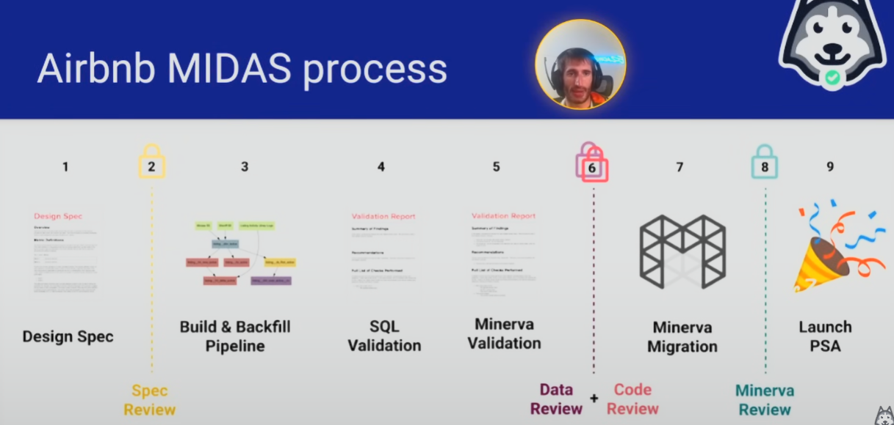
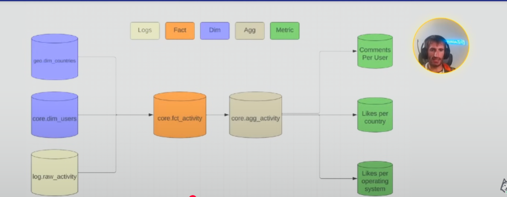

# BUILDING DATA DOCUMENTATION

#### What Does Data Quality Even Mean?

- DISCOVERABLE!
    - Whether the data is easy to get
    - Solution - build a data catalogue
- Misunderstood / incomplete definitions of data quality
    - Data gap
    - Black swan event eg Covid19
    - Rare event that is hard for machine learning to understand
- There aren't any NULLs or duplicates
    - For columns that shouldn't supposed to have nulls, then it shouldn't have
    - Dimension shouldn't have duplicates
- There is business value being derived from the data
    - Generally your data pipeline should be either generating revenue or saving costs
- The data is easy to use
    - Depends on data consumers
    - For this context, things such column name etc
- The data arrives in a timely manner
    - Aligned on refresh interval with the analytics

## DATA QUALITY IS DATA TRUST + DATA IMPACT

#### How do you build high trust in data sets?

- Before you start coding, LEAN INTO EMPATHY!
    - Get your downstream stakeholders streamlined
        - Ask question so that you know what will happen in a year
        - Ask question on what to next, long term decision
- A spec review of the pipeline design
    - Should be review by data expert, and the stakeholder
- Clarify the business impact before coding
    - Take account into your promotion too
- Ask downstream stakeholders about all current and future needs
    - You should consider a pipeline that also answer their future question so you dont have to repeatedly build almost the same thing.
- Follow the Airbnb MIDAS process

#### Airbnb MIDAS Process

- 

    1. Design Spec
        - Technical design of pipeline
    2. Spec Review
        - Technical review from data architect and stakeholder
    3. Build & Backfill Pipeline
        - Write the code - spark, sql
        - Backfill one month first so analyst can validate data
    4. SQL Validation
        - The one month data will be analysed by analytics
        - Dig deep of the data
    5. Minerva Validation
        - Validating the business metrics
    6. Data Review + Code Review
        - Data architect go check the code
        - Unit test and integration test are here
    7. Minerva Migration
        - Migrate the metrics
    8. Minerva Review
        - Business metrics review by the data scientist
    9. Launch PSA

[MIDAS](https://medium.com/airbnb-engineering/how-airbnb-achieved-metric-consistency-at-scale-f23cc53dea70)

#### Why all this upfront work?

- Involvement with stakeholder dramatically increases data trust
- If anything happens, they will partially be responsible because they are the part of the pipeline
- Thus this prevents painful backfills when you miss requirement
- Also highlights where the communication gap is

#### When should you do this heavy process?

- Are important decisions being made on this data?
    - If the pipeline is just exploratory, then no need to do this cause it will be a waste of time
- Is the data not going to change much over the next year?
    - MIDAS only for multi-year master data that will be giving value over and over again

#### What is in a good design spec?

- Description (why we are building this?)
- Flow Diagrams
- Schemas
- Quality Checks
- Metric definitions
- Example queries

#### What's in a good flow diagram?

- 
- Use lucid chart

#### What does a good schema look like?

- Good names (probably fact, dim, scd, or agg  in the name)
    - Just reading the name, you can get a lot of information
- Column comments on every column!
- Follow naming conventions your company chooses!
- IF the don't have naming conventions, THERE'S A SPOT FOR HUGE IMPACT!

#### Quality Checks

- Basic checks
    - NULLS, duplicates, enum values are all valid
    - Is there a data in the column?
- Intermediate checks
    - Row count looks good, week-over-week row count cut by dimensions looks good
        - Doing daily might not be good cause of the weekend drop
        - Seasonality should be considered
    - Are business rules enforced?
- Advanced Checks
    - Seasonality adjusted row counts look good
    - Taking factor of the machine learning

#### Dimensional Quality Checks?

- Dimensional tables usually:
    - Grow or are flat day-over-day - Table is growing check is very common
    - Don't grow sharply (percent difference from last week should be small)
    - Have complex relationships that should be checked - think foreign keys in relational world

#### Fact Quality Checks?

- Fact tables usually:
    - Seasonality problems
    - Can grow and shrink
    - More prone to duplicates
    - More prone to NULLS and other row-level quality issues
- If you are using Presto, use APPROX_COUNT_DISTINCT instead of COUNT_DISTINCT for deduped checks. It's 99.9% same but more efficient.