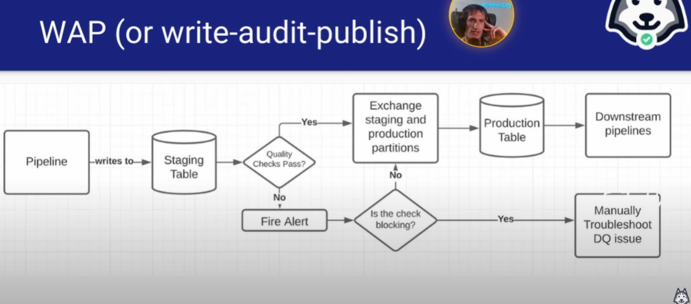
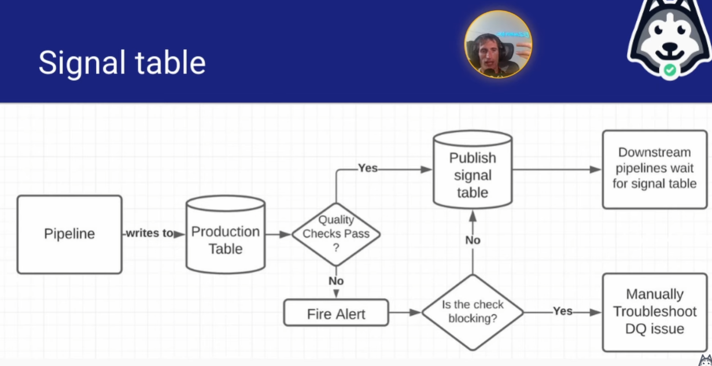

# WRITE AUDIT PUBLISH vs SIGNAL TABLE PATTERN FOR DATA QUALITY

#### What Causes Bad Data?

- Logging errors
    - Upstream error from software engineer
    - Duplicate errors by mismatched logic from event
    - More of a fact data
- Snapshotting errors
    - What happen is you missing some dimension, too many users, etc
    - More for dimensional data
    - Rare event
- Production data quality issues
    - Actual bad data in production
    - Then you have to filter it out explicitly
    - Need to work with stakeholder/software engineers to figure out
- Schema evolution issues
    - Logging schema mismatch with staging schema, mismatch with production
- Pipeline mistakes making it into production
    - Error in WHERE, CASE WHEN, JOIN, etc
- Non-idempotent pipelines and backfill errors
    - A pipeline that produces different results
- Not thorough enough validation
    - Not validate when releasing dataset

- If working with 3rd party api, they easily can violate the schema

#### Validation Best Practices

- Backfill a small amount of data (~1 month)
- Have someone else check all your assumptions
    - The idea is sometime you could be blinded by your own assumptions
- Produce a validation report
    - Duplicates
    - Nulls
    - Violation of business rules
    - Time series / volume

#### Writing to Production is a CONTRACT!

- It means you checked the data the best you could!
- The components of the contract:
    - Schema (obviously)
    - Quality checks
        - row count
        - duplicates
        - nulls, etc
    - how data shows up in production

#### 2 flavors of the Contract

- Write-audit-publish (WAP)
- Signal Table

#### Write-audit-publish (WAP)

- 

#### Signal Table

- 

#### Write-audit-publish (WAP) vs Signal Table

- WAP
    - Pros
        - Non chance of production data getting written without passing audit
        - Downstream user have higher trust of production data
    - Cons 
        - Partition exchange can be something that delays the pipeline by several minutes, delaying SLA
- Signal Table
    - Pros
        - More efficient, faster, less compute
        - Data is faster readily available
    - Cons
        - Data scientist might query bad data

#### What happens when these contracts are violated?

- BAD DATA PROPAGATION
- Big problem if you have downstream dependencies
- Example
    - Dim_all_users at Facebook

#### Bad metric definitions can cause bad data as well!

- The more different data points and dimensions your metric depends on, the more prone it is to error
    - Eg knowing the engagement per qualified minute of Ethiopian children who use 7 year old iPhone devices on Christmas day is going to be a noisy metric
    - When you come up with a metric, it should be pretty broad
    - Don't be so narrow
  