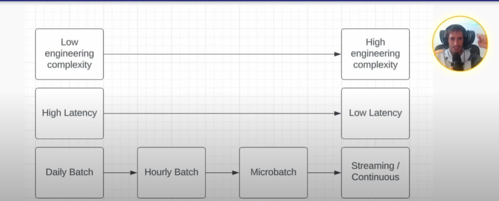

# Streaming Pipeline

#### What is Streaming Pipeline

- Method to process data in a low-latency way
- Low-latency means minutes to half an hour
- Another term is intraday

#### Differences Between Streaming, Near Real-Time and Real-Time

- Streaming (continous processing)
    - Data is processed as it is generated
    - Data just keeps flowing and never stops like a river
    - Eg: Flink

- Near real-time (microbatch)
    - Instead of process as it is generated, data is collected first before processed
    - Eg: Spark Structured Streaming

- This means that real-time and streaming are often synonymous but not always
    - You want to make sure you understand the latency requirement. Don't take stakeholder words as it is.
    - Streaming pipeline are very rare.
- Less people technical people might think real-time and batch are synonymous

#### What Do Stakeholders Mean of Real-time?

- It RARELY means streaming
- It usually means low-latency or predictable refresh rate
    - predictable refresh rate means stakeholder wants to see the data at specific time
    - discuss with stakeholder about SLA to align the data refresh
    - talking with people will help you to not overcomplicate things

#### Should You Use Streaming?

- Considerations
    - Skills on the team
        - Possibility of things becoming silo where only small no of people only know how to fix if there is issue
        - You don't want to be the guy who builds the pipeline and only you know how to deal with it, not fun when you have on call everytime
    - Incremental benefits
        - Who are using that data if it arrives early instead of doing the batches?
    - Homogeneity of your pipeline
        - Why the need to build a streaming if all your pipeline is in batch?
        - Also true on the flip side, if you are streaming team, then why do batch?
    - Tradeoff between daily batch, hourly, microbatch and streaming
        - This is a continuum and you need to understand the tradeoff between latency and complexity
    - How data quality should be inserted (batch data quality is easier)
        - Streaming data quality is harder in streaming

#### Streaming-only Use Cases

- KEY: LOW LATENCY MAKES OR BREAKS THE USE CASE
- Examples:
    - Detecting fraud, preventing bad behavior
    - High-frequency trading
    - Live event processing - sports analytics

#### Grey-area Use Case Which Micro Batch May Work Instead of Streaming

- Streaming could introduce memory errors where you hold too much data at one time
    - Proceed with microbatch if this is the case
- Also if you are serving customers where they want the latest data
    - Microbatch allows to do fullset data quality processing
    - As long as it is not the streaming only use case

#### Times When Should Not do Streaming (Proceed with Batch)

- Ask the question
    - The incremental benefit of reduced latency?
    - This should follow the use case
- Past day data is good enough for most analytical use case
    - If analyst complains data is not up to date, ask them if it was, what will change in the business?
    - Most data question is not solved within hour
    - Think of the people that stuck and mesmerize looking at the numbers and wasting time watching the dashboard
    - Impatient data stakeholder can be annoying but it does not mean you should use streaming

#### Streaming Pipeline vs Batch Pipeline

- Streaming pipeline run 24/7! Batch pipeline run for small percentage of day
- Streaming pipeline are much more software engineering oriented
    - They act a lot more like servers than DAGs
    - They needed different skillset compared than batches
- Streaming pipelines need to be treated as such and have more unit test and integration test coverage like servers
    - Batches in someway still have failsafe

#### Streaming to Batch Continuum

- 

- Real time is a myth!
    - Just for the event generation, you'll have seconds of latency - Kafka -> Flink -> sink
    - Different pieces of services will introduce more latency, even in networks
    - As you scale up the framework, latency will increase even little

#### The Structure of Streaming Pipeline

- The data sources
    - Kafka, RabbitMQ
    - Enriched dimensional sources (eg side inputs)
- The compute engine - for processing the data streams
    - Flink
    - Spark Structured Streaming
- The destination - also called the 'sink'
    - Common sink
        - Another Kafka topic
        - Iceberg
        - Postgres

#### Streaming challenges

- Out of order events
        - Data is not in right order where it landed before it processed rightly
- Late arriving data
    - Not that impactful cause batch is not processed until it got the data
    - Even if it late, the data is not processed anyway
- Recovering from failures
    - The longer you wait to fix, the longer you hold the data, so you need to backup data more and more

#### Dealing with Out of Order Events

- Flink can deal with this using WATERMARKING
    - Looks at the event time, if it have the watermark, it is confirmed to be in order

#### Dealing with Recovering from failures

- How Flink manages this?
    - Offset
        - Optional
            - Earliest offset - read all from kafka
            - Latest offset - only read new incoming data
            - Specific timestamp - 
    - Checkpoints - Automatically triggered by Flink at regular intervals during job execution
        - Managed by Flink
        - Usually apply to whole system
    - Savespoint - Manually triggered by users or programmatically via API
        - Managed and created by users
        - Usually apply to individual transaction

#### Dealing with Late Arriving Data

- How late is too late?
- Batch handles this mostly fine

