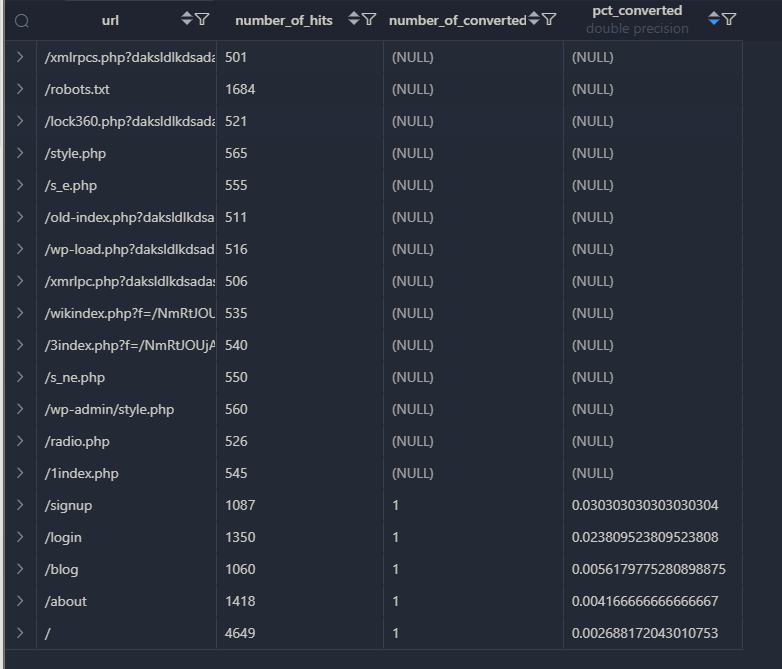
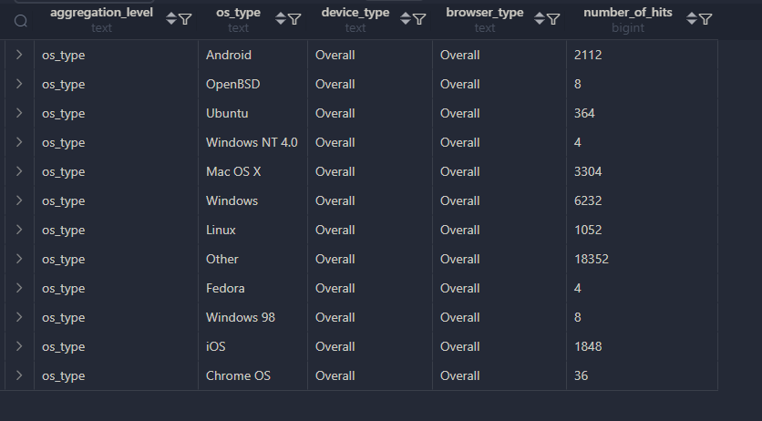

#### FUNNEL ANALYSIS

```sql
    WITH deduped_events AS (
        SELECT
            user_id,
            url,
            event_time,
            DATE(event_time) as event_date
        FROM events
        WHERE user_id IS NOT NULL
        -- AND url IN ('/signup', '/api/v1/login')
        GROUP BY user_id, url, event_time, DATE(event_time)
    ),
    selfjoined AS (
        SELECT
            d1.user_id,
            d1.url,
            d2.url AS destination_url,
            d1.event_time,
            d2.event_date
        FROM deduped_events d1
        JOIN deduped_events d2
            ON d1.user_id = d2.user_id
            AND d1.event_date = d2.event_date
            AND d2.event_time > d1.event_time
        -- WHERE d1.url = '/signup'
        --     AND d2.url = '/api/v1/login'
    ),
    userlevel AS (
        SELECT 
            user_id,
            url,
            COUNT(1) AS number_of_hits,
            SUM(DISTINCT CASE WHEN destination_url = '/api/v1/login' THEN 1 END) AS converted
        FROM selfjoined
        GROUP BY user_id, url
    )
    SELECT
        url,
        SUM(number_of_hits) AS number_of_hits,
        SUM(converted) AS number_of_converted,
        CAST(SUM(converted) AS REAL)/COUNT(1) AS pct_converted
    FROM userlevel
    GROUP BY url
    HAVING SUM(number_of_hits) > 500;
```

- 

#### GROUPING SETS
```sql
    CREATE TABLE device_hits_dashboard AS
    WITH events_augmented AS (
        SELECT COALESCE(d.os_type, 'Unknown') AS os_type,
            COALESCE(d.device_type, 'Unknown') AS device_type,
            COALESCE(d.browser_type, 'Unknown') AS browser_type,
            url,
            user_id
        FROM events e
        JOIN devices d
            ON e.device_id = d.device_id
    )
    SELECT
        CASE
            WHEN GROUPING(os_type) = 0
                AND GROUPING(device_type) = 0
                AND GROUPING(browser_type) = 0 THEN 'os_type__device_type__browser_type'
            WHEN GROUPING(browser_type) = 0 THEN 'browser_type'
            WHEN GROUPING(os_type) = 0 THEN 'os_type'
            WHEN GROUPING(device_type) = 0 THEN 'device_type'
            ELSE 'Overall'
        END AS aggregation_level,
        COALESCE(os_type, 'Overall') AS os_type,
        COALESCE(device_type, 'Overall') AS device_type,
        COALESCE(browser_type, 'Overall') AS browser_type,
        COUNT(1) AS number_of_hits
    FROM events_augmented
    GROUP BY GROUPING SETS (
        (browser_type, device_type, os_type),
        (browser_type),
        (os_type),
        (device_type));

    SELECT * FROM device_hits_dashboard
    WHERE aggregation_level = 'os_type';
```

- 