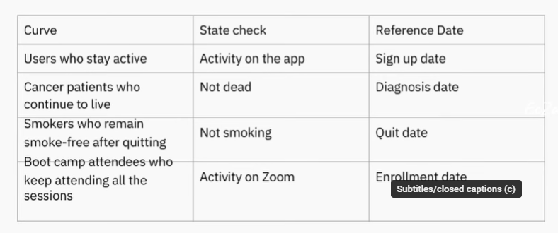

# Growth Accounting Analytical Patterns

#### Repeatable analyses are your best friend
- Common patterns 
    - State change tracking
        - Closely connected with SCD (Opposite of SCD?)
        - Keeps track everytime dimension changes, like changelog
    - Survivorship analysis
    - Window based analysis

#### Repeateable analysis
- Reduce cognitive load of thinking about the SQL
- Streamline your impact
    - Build yourself a framework, 'template' and methodology
    - You just need to be careful about the edge cases
- Thinking about the big picture instead of the code abstraction

#### Common patterns
- Aggregation-based patterns
- Cumulation-based patterns
- Window-based patterns

- In the context of we are now at master data layer that we have all the columns needed

#### Aggregation-based Patterns
- Simplest pattern
- All about GROUP BY
- Trend analysis - graph, chart
- Aggregation function like SUM, COUNT, etc
- Root cause analysis - finding cause of metric shift in dimensional, bring other dimension to do diagnose
- Upstream dataset is often the 'daily metrics'

- Consider the grain of the aggregation data, if it is too many, then it will be the same as daily data, - what's the point?
- Take only relevant dimension
- When doing long time analysis, will introduce high cardinality if it is daily
    - Consider per week or per year to reduce the row

#### Cumulation-based Patterns
- State transition tracking
    - Based on table cumulative table design
- Retention (jcurves)
- Time is a significantly different dimensions vs other ones
- FULL OUTER JOIN is your best friend
    - Difference between cumulation and aggregation is cumulation needs to keep track of when there is no data
    - No data is data in cumulation, while aggregation just ignores no data
    - The non-existences of data is something else that we want to keep track of

#### Growth Accounting
- Special version of state transition tracking
    - New (didnt exist yesterday, active today)         -+
    - Retained (active yesterday, active today)         ++
    - Churned (active yesterday, inactive today)        +-
    - Resurrected (inactive yesterday, active today)    -+
    - Stale (inactive yesterday, inactive today)        --
- These 5 state could also be reproduced to other areas, not just growth
- These metrics could monitor health of ML model and also track effectiveness of whatever you are doing

#### Survivorship Analysis and Bias
- Retention = Survivor

    - 

#### Window-based Analysis
- DoD / WoW / MoM / YoY
- Rolling Sum / Average
    - Rolling Sum - Cumulative over a certain window
    - PARTITION BY ROWS BETWEEN PRECEDING AND CURRENT ROW
    - Example is moving average in trading chart
- Ranking