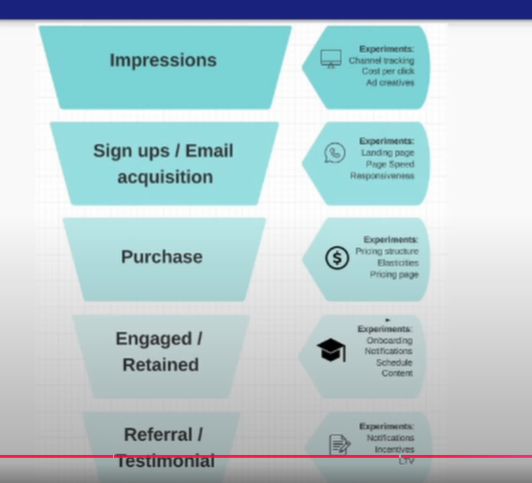

# METRICS AND FUNNELS

#### Leading vs Lagging Metrics
- Metrics should be linked to either reduced cost or increased revenue
- Revenue metrics often moves pretty slowly
- Revenue (lagging metric)
- Input vs Output
    - Web page visit (input/leading metric)
    - Revenue (output/lagging metric)
- Also applicable to your real life
    - Leading metric could be 'hours spent practicing SQL'
    - Lagging metric could be 'job offers received'
    - Extreme lagging metric ' how many students got better jobs from what I taught them?'
    - Conversion rate might be 'hours applying divided by job interviews'

#### The top of JOB Funnel
- Effort/Learning
- Brand building / networking
- Common mistakes
    - Tutorial hell
    - Going too broad
    - Not networking
    - Networking only on LinkedIn
        - Networking is not just passing resume

#### The middle of the JOB Funnel
- Brand building / networking
- Job Interview
- Common mistakes
    - Applying only to 100% qualified jobs
    - Only filling out apps, not networking

#### The bottom of the JOB Funnel
- Job Interview
- Job Success / Promotion
- Common mistakes
    - Not asking questions in interview
        - IF YOU COULD CHANGE 1 THING ABOUT THE JOB, WHAT WOULD IT BE
        - Ask what to do to bring the job to next level
    - Not recognizing unsupportive managers
        - Ask question if you are 2 weeks behind for a project completion, what would they react to that
    - Talk with individual manager, not the hiring manager to smell the bs
- Only focusing better at code
    - See more on leadership, design, scalability
    - Finding pain points

#### The end of the JOB Funnel
- Job Success / Promotion
- Help Others / Change world
- Common mistakes
    - Staying in toxic job because of pay
    - Not caring enough to help others

#### Leading vs Lagging Metrics
- Products analytics example:
    - Most extreme leading metric - ad spend on an impression
        - Click on link at google search
    - Most extreme lagging metric - testimonial / repeat purchase

#### The Funnel That Runs The World!

- 

1. Impression
2. Sign ups / Email acquisition
3. Purchase
4. Engaged / Retained
5. Referral / Testimonial

## **Product Analytics Funnel**

#### Top of funnel
- Impressions
    - Experiments
        - Channel tracking (referral column)
        - Cost per click
        - Ad creatives
- Sign ups / Email acquisition (newsletter to get email)
    - Experiments 
        - Landing page (work with front end person)
        - Page speed (fast page speed could also means less data acquired, keyword is balance)
        - Responsiveness

#### Middle of Funnel
- Purchase
    - Experiments
        - Pricing Structure (discount could upset current customer, be careful)
            - Decoy strategy?
            - Give people options on product they could fit
        - Elasticities
            - More you raise prices, fewer people buy
            - Less you raise prices, more people buy
            - Pick your game, volume or premium
        - Pricing page

#### Retention part of Funnel
- Engaged / Retained
    - Experiments
        - Onboarding - Make it smooth
        - Notifications - To keep people retained attention
        - Schedule - Make it predictable daily/weekly
        - Content - Incentivized to keep people engaged - make exclusive FOMO content

#### Virtuous Cycle of Funnel
- Referral / Testimonial
    - Experiments
        - Notifications
        - Incentives
        - LTV (lifetime value) - Mentorship / Networking / Community

### All the Metrics That You Defined and Mentioned, You Should Be Able to Place it in the Funnel! with A Cohesive Storytelling
- If it does not fit anywhere in the funnel, most likely it is a waste of time
- Some edge cases, cost and optimization

#### How to Think Like a Product Manager
- Through every step of the funnel, "what's sparking joy or pain?"
    - Then you'll be optimizing the funnel 

#### Bootcamp examples (Impression / Prospective Student)
- Students learn something and are happy when they read my content on LinkedIn, TikTok and Instagram about data engineering
- Students get deeper knowledge when signing up for my newsletter where I have a closer connection to them

#### Bootcamp examples (New Student)
- When you buy the bootcamp, you get immediate access to a huge content library. Students like that
- When you buy the bootcamp, there's a delay in getting added to GitHub and Discord, students don't like that (Get it fixed!)

#### Bootcamp examples (Engaged Students)
- Students are happy when put into groups so they feel less alone
- Students are happy when they get mentors as a reward for being engaged
- Students feel pain when they get overwhelmed by the intensity of the bootcamp (Get it fixed!)

#### Bootcamp examples (Referral / Testimonial)
- Students feel very happy when they land a better job from the skills they learned in the bootcamp. Then they will tell everybody about the bootcamp / product.