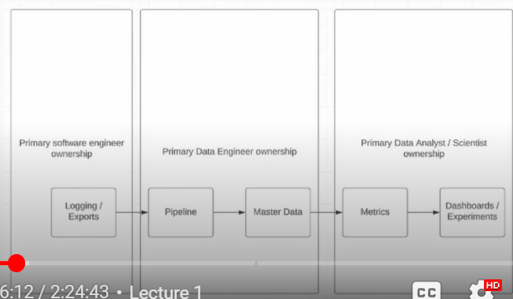
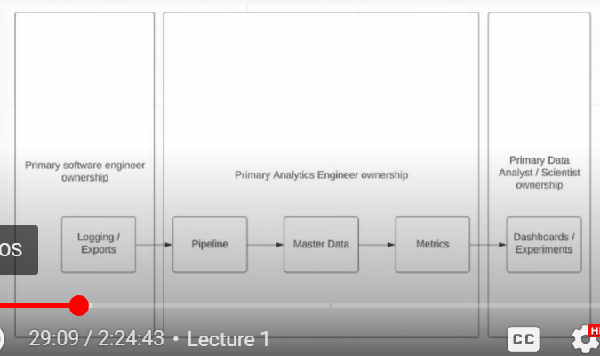
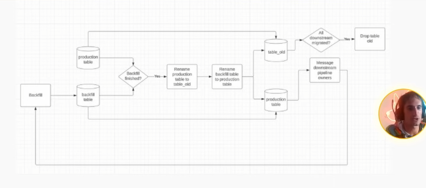

# DATA PIPELINE MAINTENANCE

## Every Pipeline You Build, Slowly Crushes You With Maintenance Costs
- In some way, doing data engineering is unsustainable because as you build more pipeline, you need to maintain more

#### Key Highlight
- Difficult parts of the data engineering job
- Ownership models of dataset
- Team models for data engineering
- Common problems you'll run into maintaining pipelines

## Data Engineering Isn't Just Writing SQL and Sipping Martinis On A Beach
- Data engineer burnout is real
- Data engineering will eat you alive if you not protecting your peace

#### The Difficult Parts of Data Engineering
- High expectations / burnout
- Data quality issues
- Unclear priorities / Adhoc requests

#### High Expectations
- Building pipelines is a MARATHON
- Analytics is a SPRINT
    - Because in a context, analyst should answer faster
- SAY NOT TO SPRINTING THE MARATHON
    - Every time you cut corners to build pipeline just to answer someone faster, it will make you regret
    - Because they will come back to you either because of quality issues, or missing columns
- DON'T RUSH!
- Don't take it personal
    - Say to yourself we are not saving lives here
    - Even you bring the data late, everything will be the same
    - Because businesses don't move very quickly in general

#### Ad-hoc Requests
- Analytics need to solve URGENT problem
    - If everything is urgent, then nothing is urgent
- Allocate 5-10% per quarter to ad-hoc requests
    - Means that if the request is ad-hoc and complex, you should't drop what you're doing
    - Low hanging fruit can be prioritized though!
    - Complex ad-hoc, push back and ask them to wait
        - If you keep saying yes, they are not going to change how they interact with you
        - Before doing any request, lay out a master plan quarterly so they can expect some timeline
- Most analytics questions are less urgent than they appear
    - Except some edge cases, law enforcement, or any that could be applied
- Get analytic partners input for quarterly planning so ad-hoc requests become scalable models

#### Ownership Models
- Who owns what?
    - Datasets
    - Data pipelines
    - Data documentation
    - Metrics
    - Experimentation

#### Most Common Ownership Models

- 

- Primary Software Engineer ownership (Logging/Exports)
- Primary **Data Engineer** (Pipeline, Master Data)
- Primary Data Analyst, Data Scientist (Metrics, Dashboards/Experimentation)
    - Business questions is here

#### Another Common Pattern

- 

- Primary Software Engineer ownership (Logging/Exports)
- Primary **Analytics Engineer** (Pipeline, Master Data, Metrics)
- Primary Data Analyst, Data Scientist (Dashboards/Experimentation)
    - Business questions is here
- This pattern is some way is bad cause analytics engineer is owning multiple things in his plate

#### Where Do Ownership Problems Arise?
- At the boundaries
    - Data Engineer owning logging!
        - Data Engineer that goes too far upstream
    - Data Scientist writing pipelines!
        - Data Engineer that is not doing his job properly
    - Data Engineer owning metrics!
        - Data Engineer that is being overwhelmed to do all things
- Don't goes too deep doing other people's job
    - Easily gets burnout

#### What Happens When These Crossed Boundaries Persist?
- Burnout
- Bad team dynamics
- The blaming game
    - Also they could be thinking you are taking credit and doing their job
- Bad cross-functional support
    - Due to multiple ownership of things/boxes, going vacation will break the work flow
    - Need to have backup, but first thing to do is to fix the ownership problem
- SOLVE THESE PROBLEMS ORGANIZATIONALLY NOT TECHNICALLY
    - It is better to talk/discuss with people than to be a hero

#### Centralized vs Embedded Teams
- Centralized: Many Data Engineer in one team
    - Oncall is easier
        - Ask them what are the consequences if you don't fix the pipeline at 3am in them morning
        - Have conversation with your downstream team so that they know what you'll do if the pipeline breaks
    - Easy to get support
    - Knowledge sharing, DE supporting DE
    - EXPENSIVE
    - Prioritization can get complex
- Embedded: Data Engineer in other engineering teams
    - Dedicated Data Engineer support
    - Data Engineer gains deep domain knowledge
    - ISLAND OF RESPONSIBILITY
    - Data Engineers can feel isolated

#### Common Issues in Pipelines You're Bound to Face as a Data Engineer
- Skewed pipelines that OOM
- Missing data / schema change of upstream data
- Backfill needs to trigger downstream data sets
- Business questions about where and how to use data

#### Fixing Data Skew
- Best option
    - Happened when GROUP BY and JOIN, where one key has a lot of data compared to others
    - Upgrade to Spark 3 and enable adaptive execution
- Second best option
    - Bump up the executor memory and hope not skewed later
- Third best option
    - Update the job to include a skew join salt
    - Add random value to the key of each record before partitioning

#### Missing Data / Schema Change
- Pre-check your upstream data
    - Will prevent your pipeline from running if it's missing data
- Track down the upstream owner
    - Log ticket so they can fix them fast (both unblock and also long-term fix solution)

#### Backfill Triggers Downstream Pipeline
- Small migration:
    - Do a parallel backfill into table_backfill
    - If everything looks good, do the 'shell game'
        - Rename production to production_old
        - Rename table_backfill to production
- If people need a lot more time migrate (lot more painful)
    - Build a parallel pipeline that populates table_v2 while production gets migrated
    - After all references to production have been updated, drop production and rename table_v2 (and all its references) to production
    - Versioning should be dropped after migration due to confusion that will caused, stick to one fixed naming

- 

#### Business Questions
- Set an SLA on when you'll get back to people. Maybe it's 2 hours maybe it's a day?
    - let them have an expectation when reaching to you
- Consolidate common questions into a document so you don't have to keep answering the same questions over and over again
    - You get more efficient this way
- Is this the same or different oncall from the pipeline oncall?
- Make sure your analytics partners are looped in here