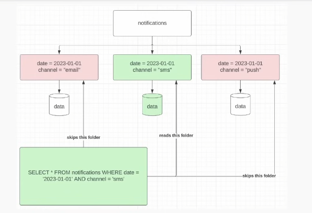

# TECHNICAL DEBT IN DATA ENGINEERING

#### Signals of Tech Debt in Data Engineering
- Painful pipelines that break or are delayed
- Large cloud bills
- Multiple sources of truth
- Unclear data sets that aren't documented

#### Path Forward for Painful Pipelines
- The only thing better than optimized is deprecated
    - Sometimes this is the right play
    - If the data is not being used, why maintain it?
- Is there anything that can be done?
    - New technology/framework
    - Better data modelling
    - Bucketing?
    - Sampling?
- Deprecating without a replacement can be a hard sell!

#### Technology Upgrades for Pipelines
- Hive to Spark migration?
    - Often sees an order of magnitude increase in efficiency
    - Esp pipelines that use high-cardinality GROUP BY and/or JOIN
    - Spark is more efficient but less reliable than Hive due to on-memory vs on-disk thingy

#### Sampling
- When should you sample?
    - Sometimes you don't need a full dataset
    - If directionality and concept are important, this is where sampling data is good enough
    - Consult with data scientists to guarantee you get the best sample of dataset
    - How? 2 ways of sampling (example)
        - Take a small percentage users of all requests
        - Take all requests for small percentage of users
- When not to sample?
    - If you need entire data set for auditing purposes, sampling is not a good idea

#### Bucketing
- Consider bucketing when
    - You have expensive high-cardinality GROUP BY or JOIN
        - Bucketing avoids shuffle which is expensive
- Not worth it if small data
    - Expensive i/o

#### Large cloud bills
- IO is usually the number one cloud cost!
    - Check your downstream usage
- Followed by compute and then storage
- Why IO?
    - Duplicative data models
        - Different terms across team, causing communication overhead
    - Inefficient pipelines (use cumulative design when possible)
        - Scan a lot of data when you only need a small chunk
    - Excessive backfills
        - Backfill 1 month of data, validate, only then you starts to backfill other month
        - Don't backfill all without validating them
    - Not sampling
        - Sometimes you dont need all data
    - Not subpartitioning your data correctly (predicate pushdown is your friend)
        - Similar to ENUM - subpartition where it ignores irrelevant records
        - Predicate pushdown - moving filter conditions ("predicates") as close as possible to the data source before processing begins.

#### Why Subpartitions Minimize IO?
- 
- Very good for low-cardinality data, it avoid scanning all data, only skip to needed WHERE clause filter
- This is where subpartitions come into play

#### Large Cloud Bills
- Large IO and compute costs are correlated by:
    - Scanning too much data (use cumulative tables please)
    - O(n^2) algorithms applied in UDFs (nested loops are usually bad)
- Large IO and storage costs are correlated by:
    - Not leveraging Parquet file format effectively
        - Data is not compressed enough
    - Duplicative data models
        - Different definition of the same thing

#### Multiple Sources of Truth
- Some of the hardest (most impactful) work for data engineers
- Steps
    - Document all the sources and the discrepancies
        - Get the know the term/data they used
    - Understand from stakeholders why they needed something different
        - Get them in a room to discuss their definition
    - Build a spec that outlines a new path forward that can be agreed upon
- Multiple sources of truth does not mean 1 of them is true, you could be a new one that is agreed from the discussion