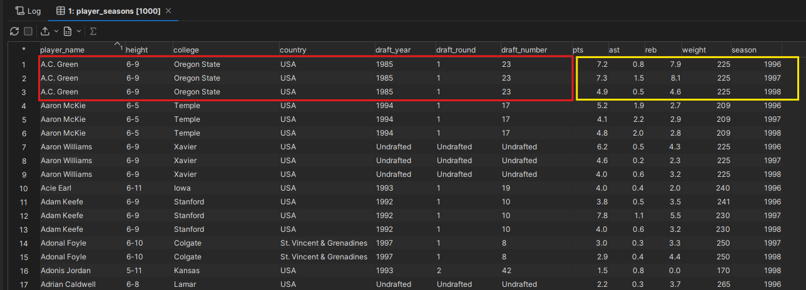
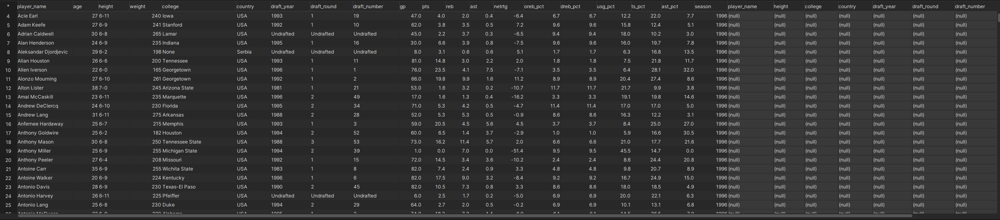
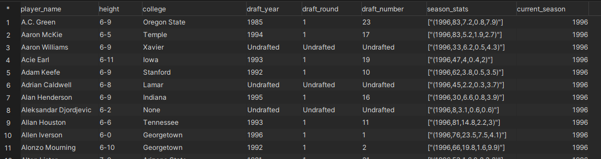
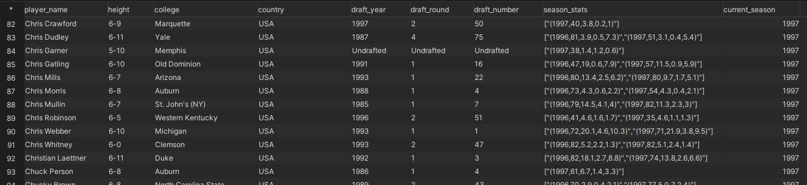
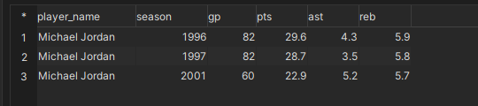
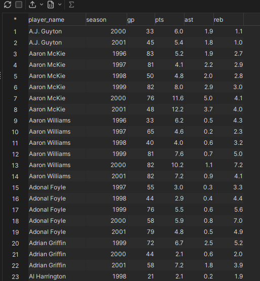

# :wrench: Building Cumulative Table Design 

- Data will be based on data dump in the postgresql database.

## :flashlight: STEP 1: Identify which column is temporal and which is fixed.

- For this case, we need columns like **`player_name`, `height`, `college`, `country`, `draft_year`, `draft_round`, `draft_number`, `season`, `gp`, `pts`, `ast`, `reb`, `weight`**.

- Then we could categorized them as **FIXED** (**`player_name`, `height`, `college`, `country`, `draft_year`, `draft_round`, `draft_number`**) and **TEMPORAL** (**`season`, `gp`, `pts`, `ast`, `reb`, `weight`**).
    - Temporal - attributes that change over time
    - Fixed - welp, it is fixed and do not changed

- **RED** is the fixed data while **YELLOW** is temporal

     
- While we know we can aggregate the **RED** value because the value is same throughout the records, we can create a `STRUCT/ARRAY` data type to contain all the **YELLOW** value in one column.

## :hammer: STEP 2: Creating `STRUCT` Data Type

- Confirm the temporal columns, and run this query, make sure to follow the data type format.

    ```sql
        CREATE TYPE season_stats AS (
                            season Integer,
                            gp INTEGER
                            pts REAL,
                            ast REAL,
                            reb REAL);
    ```
- Now we have a new `STRUCT` data named `season_stats` that comprises of all the temporal columns.
- Next, create the main table to store the data. We will store the season_stats data in the `season_stats` column. The `primary key` is based on the `player_name` and `current_season` because this 2 will be the unique identifier as the table builds up.

    ```sql
        CREATE TABLE players (
            player_name TEXT,
            height TEXT,
            college TEXT,
            country TEXT,
            draft_year TEXT,
            draft_round TEXT,
            draft_number TEXT,
            season_stats season_stats[],
            current_season INTEGER,
            PRIMARY KEY (player_name, current_season));
    ```

## :scissors: STEP 3: Creating The Cumulative Table

- The first step of this is knowing how early we need to build this table. We can use this query to check the earliest year of the data.

    ```sql
        SELECT MIN(season) FROM player_seasons;
    ```

- Now we know the earliest data is from **1996**, so we can proceed to start at **1995** as part of the `'yesterday'` and `'today'` data

- Let's check the data first. This somehow will be kind of the basis of what we want to build.

    ```sql
        WITH yesterday AS (
            SELECT * FROM players
            WHERE current_season = 1995
        ),
        today AS (
            SELECT * FROM player_seasons
            WHERE season = 1996
        )
        SELECT * FROM today t
        FULL OUTER JOIN yesterday y
            ON t.player_name = y.player_name
    ```
- It should be null for the **1995** colums because the earliest year is at **1996**

    

- Let's build the query first. There are several things that are happening here. Firstly, all the **FIXED** data will be **COALESCED** between yesterday and today. The `season_stats` column are build by filling the value if yesterday data is not null first, but if coming data is not null, we want to hold the value from yesterday.
- This may sound complicated, but it is a needed procedure to build the cumulative table.

    ```sql
        WITH yesterday AS (
            SELECT * FROM players
            WHERE current_season = 1995
        ),
        today AS (
            SELECT * FROM player_seasons
            WHERE season = 1996
        )
        SELECT
            COALESCE(t.player_name, y.player_name) AS player_name,
            COALESCE(t.height, y.height) AS height,
            COALESCE(t.college, y.college) AS college,
            COALESCE(t.country, y.country) AS country,
            COALESCE(t.draft_year, y.draft_year) AS draft_year,
            COALESCE(t.draft_round, y.draft_round) AS draft_round,
            COALESCE(t.draft_number, y.draft_number) AS draft_number,
            CASE WHEN y.season_stats IS NULL THEN ARRAY[ROW(
                    t.season,
                    t.gp,
                    t.pts,
                    t.ast,
                    t.reb)::season_stats]
                WHEN t.season IS NOT NULL THEN y.season_stats || ARRAY[ROW(
                    t.season,
                    t.gp,
                    t.pts,
                    t.ast,
                    t.reb)::season_stats]
                ELSE y.season_stats
            END AS season_stats,
            COALESCE(t.season, y.current_season + 1) AS current_season
        FROM today t
        FULL OUTER JOIN yesterday y
            ON t.player_name = y.player_name
    ```
- The data will look like this. Check out the `season_stats` column.

    

## :telescope: STEP 4: Inserting the Data into the Cumulative Table

- Adjust the previous query by adding **`INSERT`** syntax to the `players` table - the table that will store the cumulative data. You can straightaway populate the data by changing the `current_season` and `season` to increasing year respectively.

    ```sql
        INSERT INTO players
            WITH yesterday AS (
                SELECT * FROM players
                WHERE current_season = 1995
            ),
            today AS (
                SELECT * FROM player_seasons
                WHERE season = 1996
            )
            SELECT
                COALESCE(t.player_name, y.player_name) AS player_name,
                COALESCE(t.height, y.height) AS height,
                COALESCE(t.college, y.college) AS college,
                COALESCE(t.country, y.country) AS country,
                COALESCE(t.draft_year, y.draft_year) AS draft_year,
                COALESCE(t.draft_round, y.draft_round) AS draft_round,
                COALESCE(t.draft_number, y.draft_number) AS draft_number,
                CASE WHEN y.season_stats IS NULL THEN ARRAY[ROW(
                        t.season,
                        t.gp,
                        t.pts,
                        t.ast,
                        t.reb)::season_stats]
                    WHEN t.season IS NOT NULL THEN y.season_stats || ARRAY[ROW(
                        t.season,
                        t.gp,
                        t.pts,
                        t.ast,
                        t.reb)::season_stats]
                    ELSE y.season_stats
                END AS season_stats,
                COALESCE(t.season, y.current_season + 1) AS current_season
            FROM today t
            FULL OUTER JOIN yesterday y
                ON t.player_name = y.player_name
    ```

- Try checking the data from the `**players**` table to have a look what it looks like.

    ```sql
        SELECT
            *
        FROM players
        WHERE current_season = 1997;
    ```

- The complicacies that we build by having a conditional statement for the season_stats allow the column to not store the data if it is null while holding the value even the current_season is changing. Again, this may sounds complicated, but it is a necessary step to take only distinct values and not duplicate them many times.

    

## :memo: Flattening the Cumulative Table

- If you want to flatten the data and retrieve the column like as it is. you can use **`UNNEST`**. Here what it looks like. For example we want to query `current_season=2001` and` player_name='Michael Jordan'`.

    ```sql
       WITH unnested AS (
            SELECT
                player_name,
                UNNEST(season_stats)::season_stats AS season_stats
            FROM players
            WHERE current_season = 2001
                AND player_name = 'Michael Jordan'
       )
        SELECT
            player_name,
            (season_stats::season_stats).*
        FROM unnested
    ```

- Here you can see the data is **flattened**.

    

- One thing to note that is by using cumulative design and holding the temporal column in one component, it **will not shuffle** the data in a way that **will not ruin compression efficiency**.

    