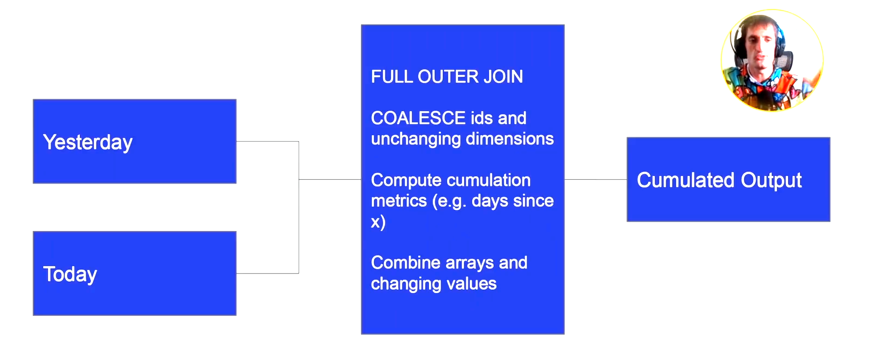

## :question: What is a Dimension?

 :straight_ruler: **Dimensions are attributes of an entity (user's birthday, user's fav food)**
- Some of these dimensions may **IDENTIFY** an identity (user's ID, device ID)
- Others are just attributes

**:triangular_ruler: Dimensions come in 2 flavours**
- **Slowly-changing-dimensions (SCD)** - **time** dependent (metrics)
- **Fixed** - 1 value that **never** changed (birthday)

**:arrow_upper_right: Knowing Your Consumer (Data modelling use case)**
- Data Analysts / Data Scientist
    * Should be **very easy to query**. Not many complex data types.
- Other Data Engineers
    * Should be **compact** and probably harder to query.Nested types are okay.
- ML models
    * **Depends on the model** and how its trained.
- Customers
    * Should be **very easy to interpret charts**.

**:paperclip: OLTP vs Master Data vs OLAP**
- OLTP (Online transaction processing)
    * Optimizes for **low-latency**, **low-volume queries**
    * Mostly outside of data engineers realm
    * Where **software engineer** do data modelling to make their system run as quickly as possible.
    * Heavy **normalization** occurs to remove data deduplication, primary keys, constraint foreign keys among tables.
    * **Lots of JOINs** to retrieve desired data
- OLAP (Online analytics processing)
    * Optimizes for **large volume**, **aggregation** queries.
    * **Most common data modelling** that data engineer used.
    * Emphasizing on **running fast query with minimal JOINs**
- Master Data
    * **Sits in the middle** between OLTP and OLAP
    * Optimizes for completeness of entity definitions while deduped the data to avoid data duplication.

**:arrow_right: OLTP and OLAP is a continuum**
- Prodution Database Snapshots (OLTP) -> Master Data -> OLAP Cubes -> Metrics
- Think of it like 40 tables smashed to a average number of something

**:black_nib: Cumulative Table Design**
- **Core Components**
    * Hang onto **all of history**
    * 2 dataframes (yesterday and today)
    * **FULL OUTER JOIN** between 2 dataframe
    * **COALESCE** values to keep everything
- **Usages (Examples)**
    * **Growth analytics** (need to calculate all users that is why we keep all value)
    * **State transition tracking** (status of entity, either changing or same)

**:pencil2: Diagram of cumulative table design**

- **Strengths**
    * Historical analysis **without shuffle**
    * **Easy 'state transition tracking'** analysis
- **Drawbacks**
    * Can only be **backfilled sequentially** (relies on yesterday data)
    * **Handling Personally identifiable information (PII) data can be a mess** since deleted/inactive users get carried forward.

**:books: The compactness vs usability tradeoff**
- **Most usable tables usually**
    * **No complex data types**
    * **Easily can be manipulated** with WHERE and GROUP BY
    * **Analytics focused**
    * Use case: **Analytics is the main consumer**, majority consumers are less technical.
- **Most compact tables (not human readable)**
    * Are compressed to be **as small as possible**
    * **Cannot be queried** directly until decoded
    * **Software focused**, eg, for more efficient transfer/networking
    * Use case: Online systems where **latency and data volumes matter a lot**. Consumers are usually highly technical.
- **Middle-ground tables**
    * **Complex data types** (ARRAY/MAP/STRUCT)
    * **Trickier querying** but more **compact**
    * Use case: **Upstream(push) staging/master** data where **majority consumers are other data engineers**.

**:notebook Struct vs Array vs Map**
- **Struct**
    * **Keys are rigidly defined**, compression is good
    * Values can be **any type**
- **Map**
    * **Keys are loosely defined**, compression is okay
    * Values all have to be the **same type**
- **Array**
    * **Ordinal**
    * List of values that all have to be the **same type**

**:hammer: Temporal Cardinality Explosions of Dimensions**
- When you **add a temporal aspect to your dimensions** and the **cardinality increases** by at least 1 order of magnitude
- Example
    * Airbnb has ~6 million listings
        - If we want to know the nightly pricing and available of each night for the next year
            * That is 365 * 6 million or about ~2 billion nights
        - Should this dataset be:
            * Listing-level with an array of nights?
            * Listing night level with 2 billion rows?
        - **If you do the sorting right, Parquet will keep these 2 about the same size**.

**:no_entry_sign: Badness of denormalized temporal dimensions**
- If you **explode** it out and need to join other dimensions, **Spark shuffle will ruin your compression**!

**:bar_chart: Run-length encoding compression**
- Probably **most important compression technique** in big data right now
    * It's why **Parquet** file format has become so successful
- Shuffle can ruin this. **BE CAREFUL!**
    * **Shuffle happens** in distributed environments when you do **JOIN** and **GROUP BY**
- Compression nullifies same values in columns. **Reduced duplication and storage**.
- After a JOIN, **Spark may mix up ordering of rows**, thus **ruining the compression**.
- Mixed up ordering will caused **slow JOINS**.