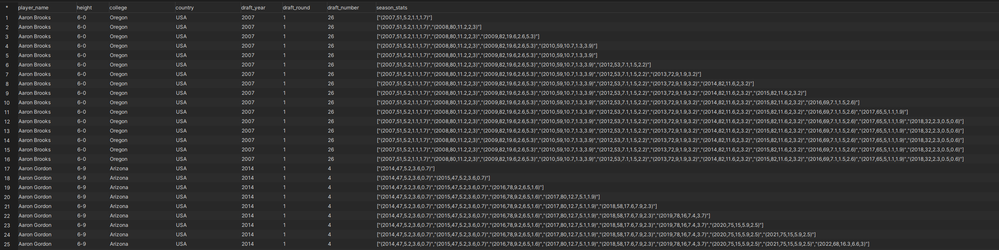
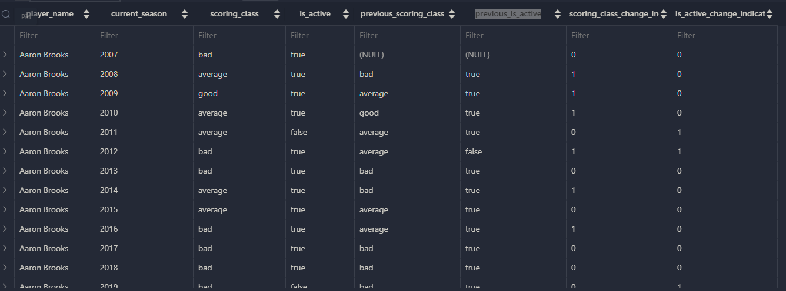
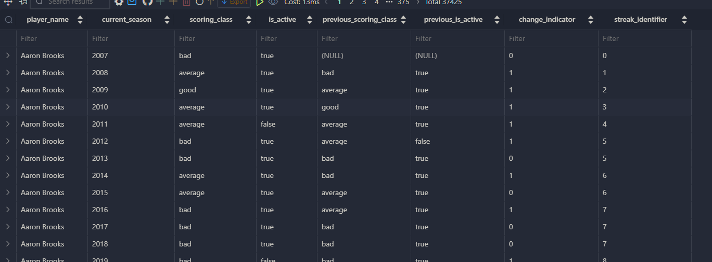
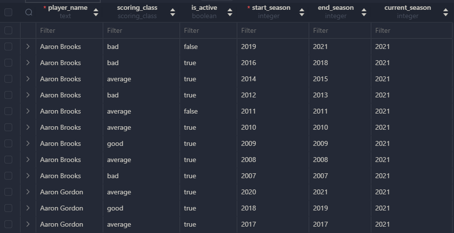

# :whale2: Building Slowly Changing Dimensions (SCD) Data Modelling

- Data will be based on data dump in the postgresql database. Follow the step [here](https://github.com/meoflaxz/data-engineering-bootcamp-2024/tree/main/1-dimensional-data-modeling) to setup the postgres using docker.
- Video lab - [Youtube]()

- We are gonna create a new **`players`** schema for this table. This also mean you have to **drop** the previous one it has already created.

    ```sql
        DROP TABLE players;
    ```

    ```sql
        CREATE TABLE players (
            player_name TEXT,
            height TEXT,
            college TEXT,
            country TEXT,
            draft_year TEXT,
            draft_round TEXT,
            draft_number TEXT,
            season_stats season_stats[],
            scoring_class scoring_class,
            years_since_last_season INTEGER,
            current_season INTEGER,
            is_active BOOLEAN,
            PRIMARY KEY (player_name, current_season));
    ```

- After creating the schema we will run the following query to populate the table. So the data is actually a cumulation and addition for every value in **`season_stats`** that we hold them in an **array**. Later on we will check the output after building the table.

    ```sql
        INSERT INTO players
        WITH years AS (
            SELECT *
            FROM generate_series(1996, 2022) AS season
        ),
        p AS (
            SELECT
                player_name,
                MIN(season) AS first_season
                FROM player_seasons
                GROUP BY player_name
        ),
        players_and_seasons AS (
            SELECT *
            FROM p
            JOIN years y
                ON p.first_season <= y.season
        ),
        windowed AS (
            SELECT
                ps.player_name, ps.season,
                ARRAY_REMOVE(
                    ARRAY_AGG(
                        CASE
                            WHEN p1.season IS NOT NULL THEN CAST(ROW(
                                                            p1.season,
                                                            p1.gp,
                                                            p1.pts,
                                                            p1.reb,
                                                            p1.ast
                                                        ) AS season_stats)
                        END ) OVER (PARTITION BY ps.player_name ORDER BY COALESCE(p1.season, ps.season)), null) AS seasons
            FROM players_and_seasons ps
            LEFT JOIN player_seasons p1
                ON ps.player_name = p1.player_name
                AND ps.season = p1.season
                ORDER BY ps.player_name, ps.season
        ),
        static AS (
            SELECT
                player_name,
                MAX(height) AS height,
                MAX(college) AS college,
                MAX(country) AS country,
                MAX(draft_year) AS draft_year,
                MAX(draft_round) AS draft_round,
                MAX(draft_number) AS draft_number
            FROM player_seasons ps
            GROUP BY player_name
        )
        SELECT
            w.player_name,
            s.height,
            s.college,
            s.country,
            s.draft_year,
            s.draft_round,
            s.draft_number,
            w.seasons AS season_stats,
            (seasons[CARDINALITY(seasons)]).pts,
            CASE
                WHEN (w.seasons[CARDINALITY(w.seasons)]).pts > 20 THEN 'star'
                WHEN (w.seasons[CARDINALITY(w.seasons)]).pts > 15 THEN 'good'
                WHEN (w.seasons[CARDINALITY(w.seasons)]).pts > 10 THEN 'average'
                ELSE 'bad'
            END::scoring_class AS scoring_class,
            w.season - (w.seasons[CARDINALITY(w.seasons)]).season as years_since_last_season,
            w.season AS current_season,
            (w.seasons[CARDINALITY(w.seasons)]).season = w.season AS is_active
        FROM windowed w
        JOIN static s
            ON w.player_name = s.player_name
    ```

- Here what it looks like for the output of above query. You can see the value of **`season_stats`** builds up for every season.

    


- We are now continuing to the actual **SCD** **modelling**. Before that, in this exercise, we would want to track two columns that is **`scoring_class`** and **`is_active`** from the players table that changed throughout the season. Now, we would need an scd table for that.

    ```sql
        CREATE TABLE players_scd (
            player_name TEXT,
            scoring_class scoring_class,
            is_active boolean,
            start_season INTEGER,
            end_season INTEGER,
            current_season INTEGER,
            PRIMARY KEY (player_name, start_season)
        )
    ```

- Let's build our data for the **`players_scd`** table. Remember we are gonna track these **2** dimension which is **`scoring_class`** and **`is_active`** throughout the season. We gonna use **`LAG`** syntax to get the value needed.

    ```sql
      WITH with_previous AS (
            SELECT
                player_name,
                current_season,
                scoring_class,
                is_active,
                LAG(scoring_class, 1) OVER (PARTITION BY player_name ORDER BY current_season) AS previous_scoring_class,
                LAG(is_active, 1) OVER (PARTITION BY player_name ORDER BY current_season) AS previous_is_active
            FROM players
        )
        SELECT
            *,
            CASE
                WHEN scoring_class <> previous_scoring_class THEN 1
                ELSE 0
            END AS scoring_class_change_indicator,
            CASE
                WHEN is_active <> previous_is_active THEN 1
                ELSE 0
            END AS is_active_change_indicator
        FROM with_previous
    ```

- These will be the foundation of what we want to track which is based on the **`scoring_class`** and **`is_active`** columns. You may observer how the **`LAG`** function do dig the old previous value and based on that we put **'1'** if the value has changed between current and past, otherwise **0**.

    

- Moving on, but not yet finishes, based on the data that we have built, we are gonna add new metrics which is **`streak_identifier`**. The idea is we will track how many state changes for the value of both **`scoring_class`** and **`is_active`**. This is also the base of the objective of SCD, cause if the dimension do not change, then we do not have to write the same thing twice. Have a look at the query and run it for yourself.

    ```sql
        WITH with_previous AS (
                SELECT
                    player_name,
                    current_season,
                    scoring_class,
                    is_active,
                    LAG(scoring_class, 1) OVER (PARTITION BY player_name ORDER BY current_season) AS previous_scoring_class,
                    LAG(is_active, 1) OVER (PARTITION BY player_name ORDER BY current_season) AS previous_is_active
                FROM players
            ),
            with_indicators AS (
                SELECT
                    *,
                    CASE
                        WHEN scoring_class <> previous_scoring_class THEN 1
                        WHEN is_active <> previous_is_active THEN 1
                        ELSE 0
                END AS change_indicator
                FROM with_previous
            ),
            with_streaks AS 
            SELECT *,
                SUM(change_indicator) OVER (PARTITION BY player_name ORDER BY current_season) AS streak_identifier
            FROM with_indicators
    ```
- The **`streak_identifier`** now tracks all the previous state changes. But you need to remember that the state changes will track all the indifferent regardless of their hierarchy level between **`scoring_class`** and **`is_active`** columns (at least that is what this exact model does).

    

- For the last part for the **`players_scd`** table that we are building, we will insert all the data by aggregating all of the data by finding min value and MAX value for current_season as the players start_season and end_season. Additionally we will filter the base data for **`current_season`** to less than **2022** as the reference point, so that we can refer **`current_season`** as 2021. 

    ```sql
      INSERT INTO players_scd
      WITH with_previous AS (
            SELECT
                player_name,
                current_season,
                scoring_class,
                is_active,
                LAG(scoring_class, 1) OVER (PARTITION BY player_name ORDER BY current_season) AS previous_scoring_class,
                LAG(is_active, 1) OVER (PARTITION BY player_name ORDER BY current_season) AS previous_is_active
            FROM players
            WHERE current_season <= 2021
        ),
        with_indicators AS (
            SELECT
                *,
                CASE
                    WHEN scoring_class <> previous_scoring_class THEN 1
                    WHEN is_active <> previous_is_active THEN 1
                    ELSE 0
            END AS change_indicator
            FROM with_previous
        ),
        with_streaks AS (
            SELECT *,
                SUM(change_indicator) OVER (PARTITION BY player_name ORDER BY current_season) AS streak_identifier
            FROM with_indicators
        )
        SELECT
            player_name,
            scoring_class,
            is_active,
            MIN(current_season) AS start_season,
            MAX(current_season) AS end_season,
            2021 AS current_season
        FROM with_streaks
        GROUP BY player_name, streak_identifier, is_active, scoring_class
        ORDER BY player_name,streak_identifier DESC
    ```

- Now you can query from the **`players_scd`** table that you just have built.

    ```sql
        SELECT * FROM players_scd
    ```

- The result will show you the same data like before but now in a table

    

- There are another way to build this SCD table, the query is quite long, but has **better way of handling different types of records** by explicitly separating historical/unchanged/changed records then union them altogether.
For this query, we need to create a **`STRUCT`** type to encapsulate multiple columns in one so that we can union them with ease.

    ```sql
    CREATE TYPE scd_type AS (
                        scoring_class scoring_class,
                        is_active boolean,
                        start_season INTEGER,
                        end_season INTEGER);

    WITH last_season_scd AS (
        SELECT * FROM players_scd
        WHERE current_season = 2021
        AND end_season = 2021
    ),
    -- historical scd does not change even new data is added, this data is not processed
    historical_scd AS (
        SELECT
            player_name,
            scoring_class,
            is_active,
            start_season,
            end_season
        FROM players_scd
        WHERE current_season = 2021
        AND end_season < 2021
    ),
    this_season_data AS (
        SELECT * FROM players
        WHERE current_season = 2022
    ),
    unchanged_records AS (
        SELECT
            ts.player_name,
            ts.scoring_class,
            ts.is_active,
            ls.start_season,
            ts.current_season AS end_season
        FROM this_season_data ts
        JOIN last_season_scd ls
            ON ts.player_name = ls.player_name
        WHERE ts.scoring_class = ls.scoring_class
        AND ts.is_active = ls.is_active
    ),
    changed_records AS (
        SELECT
            ts.player_name,
                    UNNEST(ARRAY[
                        ROW(
                            ls.scoring_class,
                            ls.is_active,
                            ls.start_season,
                            ls.end_season
                            )::scd_type,
                        ROW(
                            ts.scoring_class,
                            ts.is_active,
                            ts.current_season,
                            ts.current_season
                            )::scd_type
                    ]) as records
        FROM this_season_data ts
        LEFT JOIN last_season_scd ls
            ON ts.player_name = ls.player_name
        WHERE (ts.scoring_class <> ls.scoring_class
        OR ts.is_active <> ls.is_active)
        OR ls.player_name IS NULL
    ),
    unnested_changed_records AS (
        SELECT
            player_name,
            (records::scd_type).scoring_class,
            (records::scd_type).is_active,
            (records::scd_type).start_season,
            (records::scd_type).end_season
        FROM changed_records
    ),
    new_records AS (
        SELECT
            ts.player_name,
            ts.scoring_class,
            ts.is_active,
            ts.current_season AS start_season,
            ts.current_season AS end_season
        FROM this_season_data ts
        LEFT JOIN last_season_scd ls
            ON ts.player_name = ls.player_name
        WHERE ls.player_name IS NULL
    )
    SELECT * FROM historical_scd
    UNION ALL
    SELECT * FROM unchanged_records
    UNION ALL
    SELECT * FROM unnested_changed_records
    UNION ALL
    SELECT * FROM new_records;
    ```

- IMO the first method is very straightforward to do build SCD because the **query is more compact**. The second way **does not process the past data** and **only process the incoming records**. Also the other thing to take note is the conditional scd detection which is using NULL or <> like this:

    ```sql
        WHERE (ts.scoring_class <> ls.scoring_class
        OR ts.is_active <> ls.is_active)
    ```  
- If the column suddenly have NULL, it will **break the pipeline**, so you have to keep in mind and make sure of your data quality assumption.
                