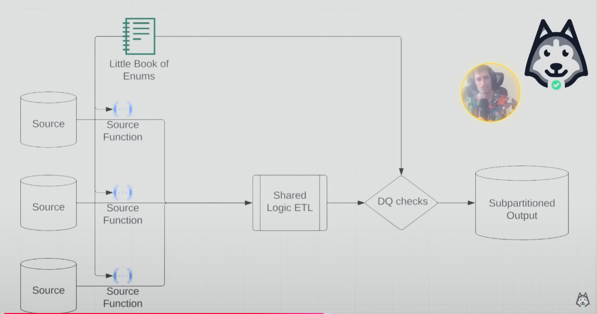
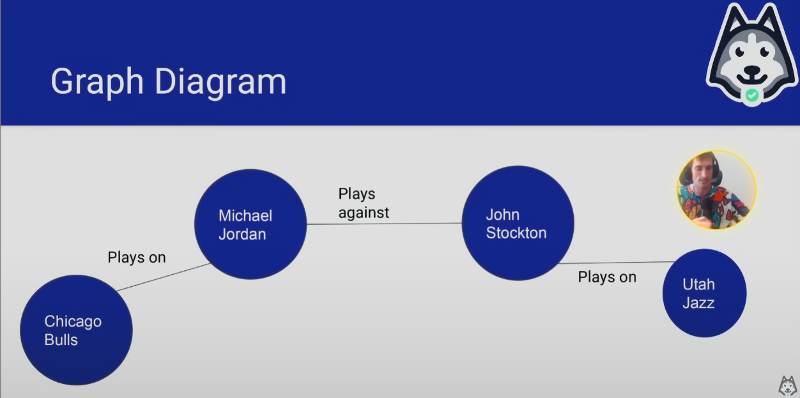

# Graph Databases And Additive Dimensions

- Additive vs non-additive dimensions
- The power of ENUMS
- When to use flexible data types?
    - struct is not flexible, coz have to define key
    - map is flexible, eg JSON
- Graph data modelling

## What is Additive Dimension?

- **Additive dimension**- properties where **individual counts dont overlap/duplicat**e.
- **Additive Dimensions** (No Double-Counting):
    - Age Groups
        - Each person fits in **ONE** age group
        - Total = Sum of all groups
        - Example: 100 people total = 30 (20-30 yrs) + 40 (31-40 yrs) + 30 (41-50 yrs)

    - Education Level
        - Each student is in **ONE** grade
        - Total students = Sum of students in each grade
        - Example: 500 students = 100 (1st) + 150 (2nd) + 250 (3rd)

- **Non-Additive Dimensions** (Double-Counting Occurs):

    - Device Usage
        - One user can use multiple devices
        - 1000 total users ≠ 600 (web) + 500 (Android) + 400 (iPhone)
        - Why? **Same user counted multiple times**

    - Car Models
        - One driver can drive multiple Honda models
        - 1000 Honda drivers ≠ 500 (Civic) + 400 (Accord) + 300 (CR-V)
        - Why? **Same driver counted for each model** they drive
- Key Point: Additive dimensions ensure each entity (person/thing) is counted exactly **once**.
- Concept takeaway - Can an entity have 2 dimensional value at the same time?

## The Essential Nature of Additivity

- Basically a dimension is additive over a specific window of time - if and only if the granular data over that window can only be one value at a time

## How Does Additivity Help?

-  Don't need to use **`COUNT(DISTINCT)`** on preaggregated dimensions

    1. **Pre-aggregated Dimensions Example (Age Groups):**

        ```sql
            -- Users table:
            user_id | age_group
            1       | 20-30
            2       | 31-40
            3       | 20-30

            -- Simple COUNT works because each user has one age group
            SELECT age_group, COUNT(user_id)
            FROM users
            GROUP BY age_group;
        ```

    2. **Non-additive Example (Device Usage):**

        ```sql
            -- User_devices table:
        user_id | device_type | revenue
        1       | web         | 100
        1       | mobile      | 50
        2       | web         | 75

        -- Need DISTINCT for user count
        SELECT device_type, COUNT(DISTINCT user_id) as users
        FROM user_devices
        GROUP BY device_type;

        -- But don't need DISTINCT for revenue
        SELECT device_type, SUM(revenue) as total_revenue
        FROM user_devices
        GROUP BY device_type;
        ```
- **`SUM`** works because each user has one device type (web, mobile)
- Other metrics that can be affected by additive vs non-additive dimensions: Averages, Ratios/Percentages, Moving Averages/Running Totals
    - You **need to handle the duplicates first** before doing calculation

- **GOOD** **NEWS** - most dimension are additive though!

## When to Use ENUMS??

- **`ENUMS`** data type are great for low-to-medium cardinality.
- **Less than 50 is good**. Too much it starts to struggle. Eg country where it has 200 amount.


## ENUMS Example

```sql
    -- Creating enum
    CREATE TYPE status AS ENUM ('active', 'inactive', 'pending');

    -- Creating table
    CREATE TABLE users (
        id INT,
        user_status status
    );

    -- Query to show results
    SELECT id, user_status FROM users;

    -- Results:
    id | user_status
    1  | active
    2  | pending
    3  | inactive
    4  | active
    5  | pending
```
- An enum is similar to a set but with **key difference**s:
    - ENUM:
        - Ordered list of predefined values
        - Can only have one value at a time
        - Values are fixed after creation

    - SET:
        - Unordered collection of unique values
        - Can contain multiple values
        - More flexible, can add/remove values

## Why Use ENUMS??

- **Free data quality check**
    - If a new record has a value not in the ENUM, it will be **rejected**. Easily preventing invalid entries
- **Built in static fields**
    - By predefining values in a fixed set, in the ENUM it can have several benefits
        - Values don't change frequently
        - Faster joins and queries
        - Prevents ad-hoc value additions
- **Built in documentation**
    - Self-documenting as the allowed **values are defined** in the schema

## ENUMS as Subpartitions

- ENUM help with **subpartitioning** - 
    1. Data validation **ensures partitions always match valid values**.
    2. Performance - internal integer storage makes partitioning **faster**.
    3. Exhaustive List - you **know all possible partition** values upfront, creating some expectation before querying results.
    4. No typos/variants - prevents 'shipped' vs 'SHIPPED' creating **unwanted partitions** (example below).
    5. Schema control - **changes to partitions require schema update**.


    ```sql
    -- Create enum and table
    CREATE TYPE order_status AS ENUM ('pending', 'processing', 'shipped', 'delivered');

    CREATE TABLE orders (
    id INT,
    status order_status, -- Adding ENUM data type to table
    order_date DATE,
    amount DECIMAL
    );

    -- Insert sample data
    INSERT INTO orders VALUES
    (1, 'pending', '2024-03-01', 100),
    (2, 'processing', '2024-03-02', 150),
    (3, 'shipped', '2024-03-01', 200),
    (4, 'delivered', '2024-03-03', 120),
    (5, 'pending', '2024-03-04', 180),
    (6, 'shipped', '2024-03-02', 90);

    -- Query with PARTITION BY
    SELECT status, order_date, amount,
    SUM(amount) OVER (PARTITION BY status) as total_by_status
    FROM orders;

    -- Results:
    status     | order_date  | amount | total_by_status
    -----------|-------------|--------|----------------
    pending    | 2024-03-01  | 100    | 280
    pending    | 2024-03-04  | 180    | 280
    processing | 2024-03-02  | 150    | 150
    shipped    | 2024-03-01  | 200    | 290
    shipped    | 2024-03-02  | 90     | 290
    delivered  | 2024-03-03  | 120    | 120
    ```

- **ENUM for easier and efficient way of processing data**
    - Easier data processing
    - Better query performance
    - Simpler maintenance
    - Clear data boundaries
    - Organized analysis

## ENUMS as Schema Enforcement Pipeline 

- By having a fixed set of values, you can somehow directly applying a data quality control check to your pipeline across all data sources. Mindblown right?

    

- More reading [Little Book of Pipelines](https://github.com/EcZachly/little-book-of-pipelines)

## ENUM Use Cases

- Useful when you have tons of sources mapping to a shared schema
    - Airbnb
        - Unit economic (fees, coupons, credits, insurance, infrastructure cost, taxes, etc)
    - Netflix
        - Infrastructure graph (applications, databases, servers, code bases, CI/CD jobs, etc)
    - Facebook
        - Family of Apps (oculus, instagram, facebook, messenger, whatsapp, thread, etc)

## So How You Model Data from Disparate Sources into a Shared Schema??

- **FLEXIBLE SCHEMA** is the answer
- Enum has a same concept with graph databases which help model share properties/categories across different data sources

## About Flexible Schema 

- **Benefits**
    - No **`ALTER TABLE`** commands - BECAUSE IT IS FLEXIBLE SCHEMA, dont have to alter the schema itself
    - **Can add many columns** - Add fields dynamically
    - Schemas** dont have a ton of NULL columns** - because it will not be in the map
    - '**Other_properties**' column is pretty awesome for rarely used but needed columns

- **Drawbacks**
    - **Compression is usually worse** (esp if use JSON), they dont squish down very well
    - Readability, queryability

# Graph Databases

- Graph modelling is **RELATIONSHIP** focused, not ENTITY focused like normal DB
- Usually the model looks like (**VERTEX**)
    - **IDENTIFIER** - STRING
    - **TYPE** - STRING
    - **PROPERTIES** - MAP<STRING, STRING>

- Relationship model (**EDGES**)
    - **SUBJECT_IDENTIFIER** - STRING
    - **SUBJECT_TYPE** - STRING
    - **OBJECT_IDENTIFIER** - STRING
    - **OBJECT_TYPE** - STRING
    - **EDGE_TYPE** - STRING
    - **PROPERTIES** - MAP<STRING, STRING>

## Graph Diagram Example

- 
    